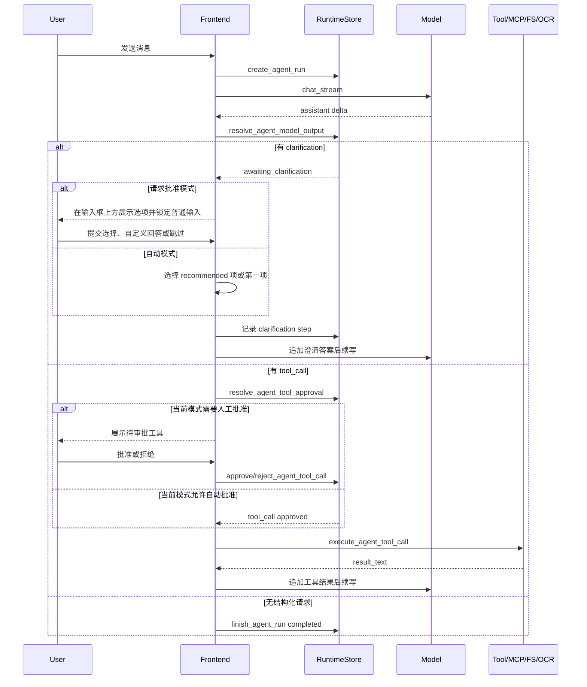

# Agent、RAG、MCP 与 Skills 设计

## 1. 模型上下文组装

前端每次发送消息前调用 `buildSystemMessage`，把运行环境组合进 system message：

- 当前项目名称、真实路径和文件树。
- 已连接 MCP 工具列表及参数 schema。
- 已启用 Skills 及自动运行参数。
- 启用的长期记忆。
- 已启用且已经形成的独立用户画像；全局回答偏好优先，其他事实按更新时间截断，当前用户输入与画像冲突时以前者为准。
- 当前对话 RAG 召回片段。
- 当前项目索引召回片段，包括代码索引和文档索引。
- OCR 图片附件提示。
- 工具调用协议说明。

这种方式让模型在没有原生 function calling 的情况下，仍能按约定输出 XML tool call。

当任务确实缺少会影响结果的关键信息时，模型还可输出结构化 `<clarification>` JSON。每次包含 1 到 3 个问题，每题包含 2 到 5 个互斥选项、可选说明、推荐标记和是否允许自定义回答。普通自然语言问句不会触发澄清面板，避免前端根据文案猜测状态。

普通手工记忆通过 FTS、sqlite-vec 和知识图谱按问题召回；用户画像不进入这套索引，而是通过 `get_profile_context` 独立读取。桌面端和 CLI 共用后端画像格式化规则，最多注入 20 条、6000 字符，避免画像无限占用固定上下文。

## 2. Tool Call 协议

模型输出格式：

```xml
<tool_call name="read_file">
  <path>src/main.tsx</path>
</tool_call>
```

内置工具：

| 工具 | 风险 | 用途 |
| --- | --- | --- |
| `read_file` | 低 | 读取项目内 UTF-8 文本文件 |
| `write_file` | 高 | 创建或覆盖项目内 UTF-8 文本文件 |
| `execute_command` | 高 | 在项目目录执行命令 |
| `ocr_image` | 中 | 调用本机 PaddleOCR 识别项目内图片文字 |
| `mcp__server_id__tool_name` | 取决于 MCP server | 调用已连接 MCP 工具 |

聊天输入区提供三种应用模式，选择结果保存在本机：

| 模式 | 审批行为 |
| --- | --- |
| 请求批准 | 所有工具调用都等待用户批准 |
| 帮我批准 | 低、中风险操作自动批准；高风险与外部写操作等待用户批准 |
| 完全访问 | 自动批准所有通过策略校验的工具调用 |

应用模式只决定是否需要人工确认，不改变工具授权范围。命令执行仍受前端 Skills 中 Bash Tool 启用状态影响；项目路径越界、内部控制目录、符号链接逃逸、未连接 MCP scope 和破坏性命令在所有模式下都会被拒绝。

工具边界由三层协作完成：

1. `src-tauri/src/plugins.rs` 通过 `AppPlugin` 声明工具定义、归属和参数 schema；`agent_runner.rs` 只解析 XML 并委托插件注册表做权威识别与参数校验。
2. `tool_policy.rs` 校验项目相对路径、内部控制目录、符号链接越界、命令破坏性和已连接 MCP scope，并给出风险级别与审批要求。
3. `resolve_agent_tool_approval` 根据应用模式和风险级别决定手动或自动批准；`execute_agent_tool_call` 只执行策略已授权的具体能力，插件注册和应用模式都不能绕过安全校验与内核执行分派。

## 3. Agent 运行时状态机

简化流程：



运行时库保留 run、step、tool call 三类记录。UI 可按会话展示最近运行过程，也可在问题排查时查看失败点。

长任务恢复采用显式状态机：模型失败的 run 可从最近持久化消息继续；工具失败后进入 `awaiting_recovery`，用户可以重试或跳过后继续。跳过的调用记为 `skipped`，恢复说明进入对话，防止模型误认为工具已经成功。工具调用保存 `attempt_count/max_attempts`，默认最多执行 3 次。应用重启时仍在执行的工具被标记为 `interrupted`，因为写入或外部调用的实际结果可能未知，必须由用户决定是否重试，禁止启动时自动重放。

澄清请求本身保存在 assistant 消息中，回答以带来源消息 ID 的 user 消息保存；run 使用 `awaiting_clarification` 状态，回答后复用同一个 run 继续模型调用。重新打开会话时，前端通过消息对和最近运行记录恢复尚未完成的澄清或工具审批。自动选择会写入运行 step，和人工选择保持可区分、可审计。

工具审批与澄清共用输入框上方的决策面板。面板、选项、禁用态和焦点样式全部使用应用主题变量，因此自动跟随深色、浅色或系统主题；它不是覆盖整个窗口的系统弹窗。

## 4. RAG 设计

### 4.1 索引

RAG 索引流程：

1. 前端接收拖拽文件或文件路径。
2. 支持格式由前端判断，复杂文档由后端抽取文本。
3. 后端归一化文本。
4. 文本分块。
5. 调用 embedding API。
6. 写入文件、chunk、embedding 和 FTS 表。

当前限制：

- 单文件最多约 200 万字符。
- RAG 数据绑定到会话，不跨会话共享。
- embedding 使用 OpenAI-compatible `/embeddings`。
- 当前索引和查询都要求 Embedding 服务成功；虽然维护 `rag_chunks_fts`，召回命令尚未使用它做降级。
- 图片文件不进入 RAG 索引，而是作为 OCR 附件保存。

### 4.2 召回

发送消息前，前端调用 `search_rag_context`：

- 查询为空时直接返回空结果。
- 当前会话没有 RAG 文件时直接返回空结果。
- 后端为 query 创建 embedding。
- 使用 query embedding 与已存 chunk embedding 的余弦相似度形成匹配。
- 结果以文件名、chunk index、score 和文本形式注入 system message。

## 5. OCR 图片附件设计

OCR 是 Agent 工具能力，不是 RAG 索引能力。用户不需要手写图片路径，前端会把图片保存为项目或临时目录内的相对路径，并把附件块写入消息。

图片入口：

1. 聊天输入区图片按钮接收浏览器 `FileList`。
2. 窗口拖拽接收系统文件路径。
3. `useChat` 按扩展名把图片和文本类文件分流；混合拖拽时图片进入 OCR 附件，文本进入 RAG。

保存流程：

1. 浏览器图片上传转为 base64，系统拖拽图片保留绝对 `source_path`。
2. 前端调用 `save_chat_image_attachment`。
3. Rust 后端通过传入的 `project_path` 解析根目录，校验格式、大小和文件名。
4. 图片写入 `.nanodesk/uploads/images/`，返回相对路径。
5. 前端把 `图片附件：<relative_path>` 追加到消息，提醒模型需要识别时调用 `ocr_image`。

渲染流程：

1. `renderMessageContent` 解析消息内容。
2. 包含图片附件时交给 `ImageAttachmentMessage`。
3. `ImageAttachmentMessage` 通过 `read_chat_image_attachment(projectPath, relativePath)` 读取 data URL。
4. 缩略图在聊天消息和归档预览中渲染，点击后打开大图预览。

附件根目录规则：

- 普通聊天页使用当前会话解析出的项目路径；没有项目时使用 `skills.tempDir`。
- 设置页 Archive 预览使用归档会话的 `project_path`；没有项目路径时回退到 `skills.tempDir`，保证旧的普通会话图片归档后仍可查看。

OCR 执行流程：

1. 模型输出 `ocr_image` tool call，参数是项目相对图片路径。
2. 进入统一分级审批链路后，后端再次校验路径位于根目录内、是普通文件、格式受支持且不超过 8MB。
3. 后端定位 `paddleocr` CLI，使用 PP-OCRv6 small 在 CPU 上执行，并用最长边、batch、线程和超时参数限制资源占用。
4. 识别结果作为工具结果消息回到对话，模型继续整理最终回答。

## 6. 项目索引中心设计

项目级索引是长期挂在项目路径上的能力，不绑定单个会话。它采用“索引中心 + 可插拔索引器”的结构：

- 代码索引器：维护代码片段、实体、关系和可选向量，用于代码结构、调用链和实现位置问答。
- 文档索引器：维护项目内 Markdown、文本、配置、JSON、CSV、HTML 等普通文件片段和可选向量，用于文档、配置、说明和数据文件问答。
- 后续索引器可以继续扩展到 PDF/Office 抽取、图片 OCR、日志专用解析或用户自定义索引器，但仍复用项目路径、run 统计、chunk、FTS 和向量召回边界。

使用流程：

1. 用户在项目区点击项目索引按钮。
2. 前端同时调用 `index_project_code(projectPath)` 和 `index_project_documents(projectPath)`。
3. Rust 后端分别扫描代码文件和文档文件，写入各自的项目级索引表。
4. 聊天发送前，代码类问题调用 `search_code_index`，普通项目资料问题调用 `search_project_index`。
5. 命中的路径、行号、实体或文档片段注入 system message，模型回答时优先引用这些上下文。

### 6.1 代码索引器

代码类问答不直接复用普通 RAG。NanoDesk 为项目维护一套代码专用索引，分为三层：

- 文件/文本层：`code_chunks` 保存项目代码片段，`code_chunks_fts` 提供全文检索入口。
- 实体层：`code_entities` 保存函数、组件、类型、接口、Rust struct/enum、Tauri command 等代码实体。
- 关系层：`code_relations` 保存 import/use、函数调用和前端 `invoke(...)` 到后端 command 的桥接关系。
- 向量层：`code_embeddings` 保存代码片段 embedding；有全局 embedding 配置时优先参与语义召回，没有配置或大项目超出轻量上限时自动降级为实体/文本检索。

首版解析器采用轻量规则扫描 TS、TSX、JS、JSX 和 Rust 文件，跳过 `.git`、`node_modules`、`target`、`dist` 等目录，避免引入额外编译期依赖。后续可以把解析器替换为 tree-sitter 或语言服务，但保留现有表结构和前端命令。

### 6.2 文档索引器

文档索引器面向更多非代码工作目录。它扫描项目内常见文本类文件，跳过 `.git`、`node_modules`、`target`、`dist`、`.codegraph` 等目录，并设置文件数量和单文件大小上限，避免打开大目录时长时间阻塞。

索引内容写入：

- `project_index_runs`：按 `project_path + indexer` 记录最新索引状态和统计。
- `project_index_chunks`：文档片段、标题、路径、行号、hash 和估算 token 数。
- `project_index_chunks_fts`：文档片段全文检索。
- `project_index_embeddings`：可选向量索引；有全局 embedding 配置且片段数未超过轻量上限时生成，失败时自动降级为全文检索。

普通 RAG 仍然是会话级上传文件能力；项目索引是项目级共享上下文，用于长期反复询问当前工作目录。

## 7. MCP 设计

MCP 配置保存在配置库，运行 session 保存在内存。

支持 transport：

- `stdio`：启动本地命令，通过 stdin/stdout JSON-RPC 通信。
- `sse`：连接远端 SSE 服务。
- `streamable_http`：使用新版 MCP streamable HTTP。

连接流程：

1. 保存 server 配置。
2. 连接时先断开同 ID 旧 session。
3. 初始化 MCP session。
4. 调用 `tools/list`。
5. 工具列表保存到 session 内存并返回 UI。

调用流程：

1. 模型输出 `mcp__server_id__tool_name`。
2. 后端解析 server_id 和 tool_name，并确认该工具属于当前已连接、已注入上下文的 MCP scope。
3. 读取 `<arguments>` JSON，经统一策略分级并按当前应用模式手动或自动审批。
4. 调用 MCP `tools/call`。
5. 返回 `content_json` 和 `is_error`。

## 8. Skills 设计

Skills 管理包含两类来源：

- GitHub 同步的 Anthropic Skills 元数据。
- Tauri app data 下的本地 `skills/` 目录。

前端把 Skills 启用状态、参数和 GitHub 来源保存在 WebView `localStorage`。发送消息时，启用的 Skills 会被注入 system message。参数支持按当前项目自动替换：

- `workspace_root`
- `output_dir`
- `skills_root`

无项目上下文时，部分参数回退到 app data 下的 `temp/` 目录。

## 9. 上下文预算与结构化滚动摘要

桌面端的上下文准备分为两个模块：`contextBudget.ts` 提供纯预算算法，`contextPreparation.ts` 负责调用模型和持久化摘要。`useChat` 只注入当前模型、`chat`、`appendMessage` 和 UI 通知；初次回答与工具结果续写复用同一入口。

### 9.1 动态预算

每次请求都以模型配置的 `context_window` 为总窗口，未配置或值无效时回退到 32768。总窗口依次扣除：

1. 安全预留：窗口的 3%，限制在 256～2048 Token。
2. 输出预留：优先使用模型配置的 `max_tokens`；未配置时按最新用户输入估算值的 1.5 倍动态计算，限制在 1024～8192 Token，且不超过窗口的 25%。
3. system message：包括核心规则、画像、项目树、RAG、项目索引、Skills 和 MCP 工具。

剩余部分才是会话消息预算。若最新用户消息本身已经无法装入输入预算，请求会直接提示缩短消息或增大上下文窗口。动态 system message 超限时保留开头的核心规则和结尾的最新检索结果，并裁剪中间的低优先级上下文。

### 9.2 触发与滚动方式

当“最近有效摘要 + 该摘要切点后的原始消息”超过会话预算时才创建新摘要：

1. 从消息尾部保留至少 6 条最近原始消息，并为摘要预留 1200 Token。
2. 把更早且尚未覆盖的消息作为摘要源；已有摘要时，将旧摘要与新增历史一起滚动合并。
3. 摘要源超过单次模型输入能力时按 Token 分批，上一批摘要作为下一批输入，保持消息顺序。
4. 持久化一条结构化 system summary，并记录 `version`、`covered_through_message_id` 和 `covered_message_count`。
5. 本次模型请求使用“最新摘要 + 切点后的最近消息”；后续请求只接受切点仍指向现存原始消息的最新有效摘要。

结构化摘要固定记录任务与目标、按顺序完成项、当前状态、待办依赖、关键决定与最近交接点，并要求以后发生的修改或撤销覆盖早期状态。

### 9.3 数据保留与降级

摘要是附加消息，不删除、覆盖或改写任何原始聊天记录，因此归档、预览和后续重新摘要仍可追溯原文。若摘要模型返回空内容、调用失败或持久化失败，本次请求降级为按预算选取最近历史，原始消息保持完整，并向用户显示降级通知。

## 10. 风险点

- XML tool call 协议依赖模型遵循提示，解析失败时需要用户重新引导。
- MCP 工具能力由外部 server 决定，风险边界不完全在 NanoDesk 内。
- 命令执行和文件写入是高风险能力，必须保留用户可见审批。
- RAG 召回质量取决于 embedding 模型、chunk 策略和源文档抽取质量。
- 项目索引首版使用轻量扫描和规则解析，适合定位和问答增强；复杂动态调用、二进制文档或超大文件仍需读取精确文件或后续接入更完整索引器。
- OCR 依赖本机 Python/PaddleOCR 环境，首次运行可能下载模型权重。
