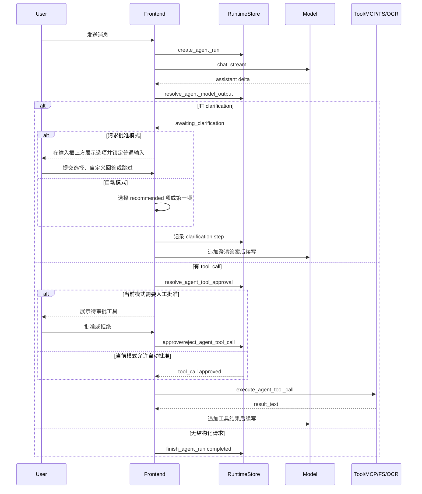

# Agent、RAG、MCP 与 Skills 设计

## 1. 模型上下文组装

前端每次发送消息前调用 `buildSystemMessage`，把运行环境组合进 system message：

- 当前项目名称、真实路径和文件树。
- 已连接 MCP 工具列表及参数 schema。
- 已启用 Skills 的元数据及参数，不包含完整 `SKILL.md` 正文。
- 按当前问题召回的启用长期记忆，以及少量标记为始终使用的个性化记忆。
- 已启用且已经形成的独立用户画像；全局事实优先（包括回答偏好、姓名和角色），其他事实按更新时间截断，当前用户输入与画像冲突时以前者为准。
- 当前对话 RAG 召回片段。
- 当前项目索引召回片段，包括代码索引和文档索引。
- OCR 图片附件提示。
- 工具调用协议说明。

这种方式让模型在没有原生 function calling 的情况下，仍能按约定输出 XML tool call。

当任务确实缺少会影响结果的关键信息时，模型还可输出结构化 `<clarification>` JSON。每次包含 1 到 3 个问题，每题包含 2 到 5 个互斥选项、可选说明、推荐标记和是否允许自定义回答。普通自然语言问句不会触发澄清面板，避免前端根据文案猜测状态。

复杂任务还可输出结构化 `<task_plan>` JSON。计划包含一个可验证目标和 2 到 12 个稳定 ID 的步骤，步骤状态限定为 `pending`、`in_progress`、`completed`、`blocked`、`skipped`，并且同时最多只有一个步骤处于执行中。计划可与单个工具调用一起输出，并在每次工具结果返回后更新；简单问答和单步操作不生成计划，避免增加无效流程。

普通手工记忆通过本地词项评分、可选 sqlite-vec 向量和知识图谱实体检索融合召回，并优先保留最多 3 条带 `personalization:always` 标签的启用记忆。管理搜索使用 `memories_fts`，图谱实体检索也使用 FTS；当前聊天的词法支路加载启用记忆后在内存评分，不查询 `memories_fts`。用户画像不进入普通记忆索引，而是由共享基础上下文中的 `load_profile_context` 独立读取；后端另提供 `get_profile_context` 命令。桌面端和 CLI 共用后端画像格式化规则，最多选择 20 条，事实行累计使用 6000 字符截断预算（首条始终保留），避免画像无限占用固定上下文。

## 2. Tool Call 协议

模型输出格式：

```xml
<tool_call name="read_file">
  <path>src/main.tsx</path>
</tool_call>
```

内置工具：

| 工具 | 风险 | 用途 |
| --- | --- | --- |
| `read_file` | 低 | 读取项目内 UTF-8 文本文件 |
| `write_file` | 中／高 | `.md`、`.txt` 或 `docs/` 下的写入判为中风险，其他路径判为高风险；创建或覆盖项目内 UTF-8 文本文件 |
| `execute_command` | 中／高 | 命中写操作规则的命令判为高风险，其余允许命令判为中风险；在项目目录执行命令 |
| `ocr_image` | 中 | 调用本机 PaddleOCR 识别项目内图片文字 |
| `mcp__server_id__tool_name` | 外部／外部高风险 | 按工具名称规则分类；调用已连接 MCP 工具 |

聊天输入区提供三种应用模式，选择结果保存在本机：

| 模式 | 审批行为 |
| --- | --- |
| 请求批准 | 所有工具调用都等待用户批准 |
| 帮我批准 | 低、中风险及普通外部工具自动批准；高风险与按名称规则识别出的外部高风险工具等待用户批准 |
| 完全访问 | 自动批准所有通过策略校验的工具调用 |

应用模式只决定是否需要人工确认，不改变工具授权范围。命令执行仍受前端 Skills 中 Bash Tool 启用状态影响。文件和 OCR 路径工具校验项目相对路径、内部控制目录及符号链接越界；MCP 工具必须属于当前连接 session 的工具列表。命令工具拒绝命中规则的高破坏性命令和大范围递归代码扫描，但只设置项目工作目录，没有文件系统沙箱，不能保证拦截命令中的所有越界访问或破坏性操作。

风险分类采用启发式规则。MCP 工具名包含 `write`、`delete`、`remove`、`exec`、`shell`、`command`、`patch` 或 `update` 时判为外部高风险，否则判为普通外部风险；当前规则不能保证识别所有外部写操作。

工具边界由三层协作完成：

1. `src-tauri/src/plugins.rs` 通过 `AppPlugin` 声明工具定义、归属和参数 schema；`agent_runner.rs` 只解析 XML 并委托插件注册表做权威识别与参数校验。
2. `tool_policy.rs` 校验项目相对路径、内部控制目录、符号链接越界、命令破坏性和已连接 MCP scope，并给出风险级别与审批要求。
3. `resolve_agent_tool_approval` 根据应用模式和风险级别决定手动或自动批准；`execute_agent_tool_call` 只执行策略已授权的具体能力，插件注册和应用模式都不能绕过安全校验与内核执行分派。

## 3. Agent 运行时状态机

简化流程：


```mermaid
sequenceDiagram
  participant U as User
  participant FE as Frontend
  participant RT as RuntimeStore
  participant LLM as Model
  participant Tool as Tool/MCP/FS/OCR

  U->>FE: 发送消息
  FE->>RT: create_agent_run
  FE->>LLM: chat_stream
  LLM-->>FE: assistant delta
  FE->>RT: resolve_agent_model_output
  alt 有 clarification
    RT-->>FE: awaiting_clarification
    alt 请求批准模式
      FE-->>U: 在输入框上方展示选项并锁定普通输入
      U->>FE: 提交选择、自定义回答或跳过
    else 自动模式
      FE->>FE: 选择 recommended 项或第一项
    end
    FE->>RT: 记录 clarification step
    FE->>LLM: 追加澄清答案后续写
  else 有 tool_call
    FE->>RT: resolve_agent_tool_approval
    alt 当前模式需要人工批准
      FE-->>U: 展示待审批工具
      U->>FE: 批准或拒绝
      FE->>RT: approve/reject_agent_tool_call
    else 当前模式允许自动批准
      RT-->>FE: tool_call approved
    end
    FE->>Tool: execute_agent_tool_call
    Tool-->>FE: result_text
    FE->>LLM: 追加工具结果后续写
  else 无结构化请求
    FE->>RT: finish_agent_run completed
  end
```

运行时库保留 run、step、tool call 三类记录。UI 可按会话展示最近运行过程，也可在问题排查时查看失败点。

最新任务计划以 JSON 保存在所属 run 中，每次更新同时生成 `planning` step，记录目标、完成数和完整计划。聊天消息展示当次计划，Agent Runtime 展示持久化后的最新版本；应用重启后选择所属会话并加载运行记录，可恢复计划视图，无需依赖前端临时计划状态。计划只描述执行状态，不替代工具审批、结果验证或失败恢复状态机。

长任务恢复采用显式状态机：模型失败的 run 可从最近持久化消息继续；工具失败后进入 `awaiting_recovery`，用户可以重试或跳过后继续。跳过的调用记为 `skipped`，恢复说明进入对话，防止模型误认为工具已经成功。工具调用保存 `attempt_count/max_attempts`，默认最多执行 3 次。应用重启时仍在执行的工具被标记为 `interrupted`，因为写入或外部调用的实际结果可能未知，必须由用户决定是否重试，禁止启动时自动重放。

澄清请求本身保存在 assistant 消息中，回答以带来源消息 ID 的 user 消息保存；run 使用 `awaiting_clarification` 状态，回答后复用同一个 run 继续模型调用。重新打开会话时，前端通过消息对和最近运行记录恢复尚未完成的澄清或工具审批。自动选择会写入运行 step，和人工选择保持可区分、可审计。

工具审批与澄清共用输入框上方的决策面板。面板、选项、禁用态和焦点样式全部使用应用主题变量，因此自动跟随深色、浅色或系统主题；它不是覆盖整个窗口的系统弹窗。

## 4. RAG 设计

### 4.1 索引

RAG 索引流程：

1. 前端接收拖拽文件或文件路径。
2. 支持格式由前端判断，复杂文档由后端抽取文本。
3. 后端归一化文本。
4. 文本按目标 1600 字符分块，重叠 180 字符，并优先按附近句子边界切分，最多生成 120 块。
5. 调用 embedding API。
6. 写入文件、chunk、embedding 和 FTS 表。

当前限制：

- 上传或读取的原文件最多 10MB，归一化文本最多 200 万字符；达到 120 个分块上限后，剩余文本不进入索引，因此较长文件需要拆分。
- RAG 数据绑定到会话，不跨会话共享。
- embedding 使用 OpenAI-compatible `/embeddings`。
- 当前索引和查询都要求 Embedding 服务成功；虽然维护 `rag_chunks_fts`，召回命令尚未使用它做降级。
- 图片文件不进入 RAG 索引，而是作为 OCR 附件保存。

### 4.2 召回

发送消息前，前端调用 `search_rag_context`：

- 查询为空时直接返回空结果。
- 当前会话没有 RAG 文件时直接返回空结果。
- 后端为 query 创建 embedding。
- 使用 query embedding 与已存 chunk embedding 的余弦相似度形成匹配。
- 结果以文件名、chunk index、score 和文本形式注入 system message。

## 5. OCR 图片附件设计

OCR 是 Agent 工具能力，不是 RAG 索引能力。用户不需要手写图片路径，前端会把图片保存为项目或临时目录内的相对路径，并把附件块写入消息。

图片入口：

1. 聊天输入区回形针附件按钮接收浏览器 `FileList`，统一入口按类型分流。
2. 窗口拖拽接收系统文件路径。
3. `useChat` 按扩展名把图片和文本类文件分流；混合拖拽时图片进入 OCR 附件，文本进入 RAG。

保存流程：

1. 浏览器图片上传转为 base64，系统拖拽图片保留绝对 `source_path`。
2. 前端调用 `save_chat_image_attachment`。
3. Rust 后端通过传入的 `project_path` 解析根目录，校验格式、大小和文件名。
4. 图片写入 `.nanodesk/uploads/images/`，返回相对路径。
5. 前端把 `图片附件：<relative_path>` 追加到消息，提醒模型需要识别时调用 `ocr_image`。

渲染流程：

1. `renderMessageContent` 解析消息内容。
2. 包含图片附件时交给 `ImageAttachmentMessage`。
3. `ImageAttachmentMessage` 通过 `read_chat_image_attachment(projectPath, relativePath)` 读取 data URL。
4. 缩略图在聊天消息和归档预览中渲染，点击后打开大图预览。

附件根目录规则：

- 普通聊天页使用当前会话解析出的项目路径；没有项目时使用 `skills.tempDir`。
- 设置页 Archive 预览使用归档会话的 `project_path`；没有项目路径时回退到 `skills.tempDir`，保证旧的普通会话图片归档后仍可查看。

OCR 执行流程：

当前默认上传附件位于 `.nanodesk/uploads/images/`，而统一工具策略拒绝访问整个 `.nanodesk` 内部目录，没有 OCR 附件例外。因此附件保存和预览已有实现，但 Agent 识别默认上传附件会被策略拒绝。以下执行流程适用于允许访问的普通项目图片路径，例如 `images/example.png`；解除默认附件的策略冲突尚未实现。

1. 模型输出 `ocr_image` tool call，参数是允许访问的项目相对图片路径，例如 `images/example.png`。
2. 进入统一分级审批链路后，后端再次校验路径位于根目录内、是普通文件、格式受支持且不超过 8MB。
3. 后端定位 `paddleocr` CLI，使用 PP-OCRv6 small 在 CPU 上执行，并用最长边、batch、线程和超时参数限制资源占用。
4. 识别结果作为工具结果消息回到对话，模型继续整理最终回答。

## 6. 项目索引中心设计

项目级索引是长期挂在项目路径上的能力，不绑定单个会话。它采用“索引中心 + 可插拔索引器”的结构：

- 代码索引器：维护代码片段、实体、关系和可选向量，用于代码结构、调用链和实现位置问答。
- 文档索引器：维护项目内 Markdown、文本、配置、JSON、CSV、HTML 等普通文件片段和可选向量，用于文档、配置、说明和数据文件问答。
- 后续索引器可以继续扩展到 PDF/Office 抽取、图片 OCR、日志专用解析或用户自定义索引器，但仍复用项目路径、run 统计、chunk、FTS 和向量召回边界。

使用流程：

1. 用户在项目区点击项目索引按钮。
2. 前端同时调用 `index_project_code(projectPath)` 和 `index_project_documents(projectPath)`。
3. Rust 后端分别扫描代码文件和文档文件，写入各自的项目级索引表。
4. 聊天初次请求和工具结果续写统一调用 `load_base_context`。后端使用共享查询向量：命中代码问题关键词时调用代码索引检索，同时对所有非空项目查询调用文档索引检索。
5. 命中的路径、行号、实体或文档片段注入 system message，模型回答时优先引用这些上下文。

### 6.1 代码索引器

代码类问答不直接复用普通 RAG。NanoDesk 为项目维护一套代码专用索引，包含三层基础索引和可选向量层：

- 文件/文本层：`code_chunks` 保存项目代码片段，`code_chunks_fts` 已维护但当前召回尚未查询它；文本召回使用实体、签名、路径和片段的 LIKE 匹配。
- 实体层：`code_entities` 保存函数、组件、类型、接口、Rust struct/enum、Tauri command 等代码实体。
- 关系层：`code_relations` 保存 import/use、函数调用和前端 `invoke(...)` 到后端 command 的桥接关系。
- 向量层：`code_embeddings` 保存代码片段 embedding；有全局 embedding 配置时优先参与语义召回，没有配置或大项目超出轻量上限时自动降级为实体/文本检索。

首版解析器采用轻量规则扫描 TS、TSX、JS、JSX 和 Rust 文件，跳过 `.git`、`node_modules`、`target`、`dist` 等目录，避免引入额外编译期依赖。后续可以把解析器替换为 tree-sitter 或语言服务，但保留现有表结构和前端命令。

### 6.2 文档索引器

文档索引器面向更多非代码工作目录。它扫描项目内常见文本类文件，跳过 `.git`、`node_modules`、`target`、`dist`、`.codegraph` 等目录，并设置文件数量和单文件大小上限，避免打开大目录时长时间阻塞。

索引内容写入：

- `project_index_runs`：按 `project_path + indexer` 记录最新索引状态和统计。
- `project_index_chunks`：文档片段、标题、路径、行号、hash 和估算 token 数。
- `project_index_chunks_fts`：维护文档片段全文索引，但当前召回尚未查询它。
- `project_index_embeddings`：可选向量索引；有全局 embedding 配置且片段数未超过轻量上限时生成，失败时自动降级为文本、标题和路径的 LIKE 匹配。

普通 RAG 仍然是会话级上传文件能力；项目索引是项目级共享上下文，用于长期反复询问当前工作目录。

## 7. MCP 设计

MCP 配置保存在配置库，运行 session 保存在内存。

支持 transport：

- `stdio`：启动本地命令，通过 stdin/stdout JSON-RPC 通信。
- `sse`：连接远端 SSE 服务。
- `streamable_http`：使用新版 MCP streamable HTTP。

连接流程：

1. 保存 server 配置。
2. 连接时先断开同 ID 旧 session。
3. 初始化 MCP session。
4. 调用 `tools/list`。
5. 工具列表保存到 session 内存并返回 UI。

调用流程：

1. 模型输出 `mcp__server_id__tool_name`。
2. 后端解析 server_id 和 tool_name，并确认该工具属于当前已连接 session 的已发现工具列表。
3. 读取 `<arguments>` JSON，经统一策略分级并按当前应用模式手动或自动审批。
4. 调用 MCP `tools/call`。
5. 返回 `content_json` 和 `is_error`。

前端根据当时可见的连接状态和工具列表构建提示词；后端在审批和执行时重新检查当前 session 的工具范围。当前没有持久化本次模型请求实际注入的 MCP 工具快照，也未将该快照绑定到运行授权。

## 8. Skills 设计

Skills 管理包含以下元数据来源：

- 系统内置预设。
- GitHub 仓库同步的 Skills 元数据，默认来自 Anthropic，也支持多个自定义仓库、路径和分支。
- Tauri app data 下的本地 `skills/` 目录。
- 手工添加的自定义条目。

GitHub 同步通过递归 Git tree 查找指定来源路径下的 `SKILL.md`，最多并发 4 个请求读取名称和描述等元数据；不下载完整技能包。单个 frontmatter 拉取失败时使用默认名称和描述。本地扫描读取 `SKILL.md` 的 frontmatter，按目录递归发现并设置深度上限。

前端把 Skills 启用状态、参数和 GitHub 来源保存在 WebView `localStorage`。发送消息时只注入启用条目的名称、ID、提供者、描述和参数，不自动加载完整 `SKILL.md` 指令、脚本或附件；同步元数据不等同于安装或执行完整技能包。参数支持按当前项目自动替换：

- `workspace_root`
- `output_dir`
- `skills_root`

无项目上下文时，部分参数回退到 app data 下的 `temp/` 目录。

## 9. 上下文预算与结构化滚动摘要

上下文预算的权威算法位于 Rust `context_budget.rs`，桌面端通过 `contextPreparation.ts` 调用它并负责摘要模型调用与持久化，CLI 则直接调用同一核心。初次回答、工具结果续写和 CLI 长对话因此采用相同的窗口预留、裁剪、摘要切点与装箱规则。

### 9.1 动态预算

每次请求都以模型配置的 `context_window` 为总窗口，未配置或值无效时回退到 32768。总窗口依次扣除：

1. 安全预留：窗口的 3%，限制在 256～2048 Token。
2. 输出预留：优先使用模型配置的 `max_tokens`；未配置时按最新用户输入估算值的 1.5 倍动态计算，限制在 1024～8192 Token，且不超过窗口的 25%。
3. system message：包括核心规则、画像、项目树、RAG、项目索引、Skills 和 MCP 工具。

剩余部分才是会话消息预算。若最新用户消息本身已经无法装入输入预算，请求会直接提示缩短消息或增大上下文窗口。动态 system message 超限时保留开头的核心规则和结尾的最新检索结果，并裁剪中间的低优先级上下文。

### 9.2 触发与滚动方式

当“最近有效摘要 + 该摘要切点后的原始消息”超过会话预算时才创建新摘要：

1. 选择摘要切点时，若尚未摘要的消息足够，则从尾部至少选择 6 条最近原始消息，并为摘要预留 1200 Token；最终模型请求仍按预算装箱，可能只包含更少条最近消息。
2. 把更早且尚未覆盖的消息作为摘要源；已有摘要时，将旧摘要与新增历史一起滚动合并。
3. 摘要源超过单次模型输入能力时按 Token 分批，上一批摘要作为下一批输入，保持消息顺序。
4. 持久化一条结构化 system summary，并记录 `version`、`covered_through_message_id` 和 `covered_message_count`。
5. 本次模型请求使用“最新摘要 + 切点后的最近消息”；后续请求只接受切点仍指向现存原始消息的最新有效摘要。

结构化摘要固定记录任务与目标、按顺序完成项、当前状态、待办依赖、关键决定与最近交接点，并要求以后发生的修改或撤销覆盖早期状态。

### 9.3 数据保留与降级

摘要是附加消息，不删除、覆盖或改写任何原始聊天记录，因此归档、预览和后续重新摘要仍可追溯原文。若摘要模型返回空内容、调用失败或持久化失败，本次请求降级为按预算选取最近历史，原始消息保持完整，并向用户显示降级通知。

## 10. 风险点

- XML tool call 协议依赖模型遵循提示，解析失败时需要用户重新引导。
- MCP 工具能力由外部 server 决定，风险边界不完全在 NanoDesk 内。
- 命令执行和文件写入可能产生高风险修改；请求批准模式保留人工审批，帮我批准按当前风险分类决定，完全访问自动批准但仍执行策略校验并记录运行过程。Shell 工作目录不是文件系统隔离，MCP 名称分类也不能完整识别外部写操作。
- RAG 召回质量取决于 embedding 模型、chunk 策略和源文档抽取质量；当前分块上限会使长文件尾部不进入索引，且 RAG 和项目索引召回尚未使用各自维护的 FTS 表。
- 项目索引首版使用轻量扫描和规则解析，适合定位和问答增强；复杂动态调用、二进制文档或超大文件仍需读取精确文件或后续接入更完整索引器。
- OCR 依赖本机 Python/PaddleOCR 环境，首次运行可能下载模型权重；默认上传附件仍被内部目录策略拒绝，目前只能按允许的普通项目图片路径进入 Agent OCR 执行链路。
