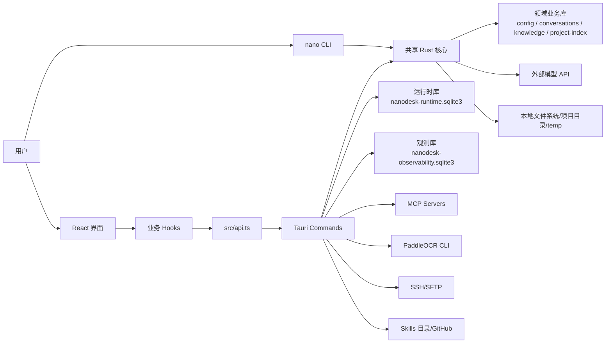

# NanoDesk 系统设计文档

## 1. 文档目的

本文档描述 NanoDesk 当前实现的系统边界、模块划分、关键数据流、存储设计、扩展机制和运维约束。它面向后续功能开发、架构评审、问题排查和打包发布。

更细的专题说明拆分在以下文档中：

- [架构与模块设计](架构与模块设计.md)
- [数据与存储设计](数据与存储设计.md)
- [用户画像异步批处理设计](用户画像异步批处理设计.md)
- [Agent、RAG、MCP 与 Skills](智能体检索增强与扩展工具设计.md)
- [PaddleOCR OCR 工具](图片文字识别工具.md)
- [构建、配置与运维](构建配置与运维.md)
- [技术栈学习路线](技术栈学习路线.md)

## 2. 系统定位

NanoDesk 是一个本地优先的桌面 AI 工作台。它不是纯聊天壳，而是把以下能力组合成一个可操作的本地客户端：

- 个人知识与工作信息管理：笔记、提示词、长期记忆。
- AI 对话：多模型配置、服务商模型列表获取、按实际模型标识选择、流式输出、动态上下文预算、无损滚动摘要和会话归档。
- 消息呈现：GFM Markdown、KaTeX 行内/块级数学公式、外部链接和项目文件链接解析。
- `nano` 终端客户端：复用模型配置、项目索引、会话存储和 Rust LLM 后端，支持项目会话恢复与临时对话。
- 项目工作区：按项目目录隔离会话，支持从项目条目右键菜单在系统文件管理器中打开项目目录，以及读写文件、浏览文件树和执行命令。
- 轻量 RAG：对话级文件上传、文本抽取、分块、embedding、召回。
- 本地 OCR：图片拖拽/上传后生成根目录内相对路径，由 `ocr_image` 工具调用 PaddleOCR PP-OCRv6 small 识别。
- Agent 工具执行：模型输出工具请求，按“请求批准 / 帮我批准 / 完全访问”模式手动或自动审批后执行，再把结果回传给模型。
- 智能文件链接：项目打开或切换时构建轻量文件列表索引，模型输出的相对路径、裸文件名和已有 Markdown 文件链接可以解析为项目内真实文件位置。
- 扩展系统：MCP 服务器、本地/远程 Skills、Tavily 搜索配置。
- Ops 工作台：SSH 服务器管理、连接测试、文件上传和交互式终端。
- 运行时可观测：LLM、MCP、Ops、部分工具和数据库操作写入独立观测库并在设置中展示。

## 3. 总体架构

完整的启动、恢复、对话、Agent 工具循环及持久化链路见 [NanoDesk 完整执行流程图](assets/nanodesk-complete-execution-flow.svg)。

系统采用 Tauri 桌面架构：

- 前端使用 React + TypeScript，负责界面、用户交互、流式事件监听和本地状态组合。
- 桌面端以 Tauri command 作为前后端边界；`nano` CLI 不经过 WebView 或 command，而是直接复用 Rust 的数据库、索引和模型模块。
- Rust 后端负责持久化、外部 API 调用、文件安全边界、MCP 会话管理、运行时记录和观测管线。
- SQLite 是本地状态中心，按业务、Agent 运行时、观测三类拆分。

## 4. 主要模块

| 层级 | 关键文件 | 职责 |
| --- | --- | --- |
| UI | `src/App.tsx`、`src/components/*` | 页面布局、侧栏、聊天区、Markdown/KaTeX 渲染、设置弹窗、观测面板、Ops 工作台 |
| 前端插件 | `src/core/plugins.tsx`、`src/plugins/builtin.tsx` | 插件注册表、主视图和设置页贡献 |
| 前端 API | `src/api.ts` | 封装 `invoke`，提供类型化 command 调用入口 |
| 前端业务状态 | `src/hooks/*` | 对话、模型、项目、RAG、MCP、Skills、记忆、观测等状态组合 |
| 前端工具 | `src/lib/*` | 系统提示构造、工具调用解析、消息渲染、格式化和安全封装 |
| 上下文预算 | `src/lib/contextBudget.ts` | Token 估算、模型窗口与输出预留、摘要切点、批次切分和上下文装箱纯函数 |
| 上下文准备 | `src/lib/contextPreparation.ts` | 摘要模型调用与持久化的异步编排、滚动摘要和失败降级 |
| Tauri 入口 | `src-tauri/src/lib.rs` | 应用状态、command 注册、系统托盘、数据库初始化 |
| 终端入口 | `src-tauri/src/cli.rs`、`src-tauri/src/bin/nano.rs` | `nano` 参数解析、首次模型配置、项目索引、会话恢复和终端交互 |
| 主业务存储 | `src-tauri/src/db.rs`、`src-tauri/src/db/*_store.rs` | `db.rs` 负责 schema、轻量迁移和共享入口；领域 store 分别负责条目、配置、会话、RAG、记忆、画像和项目索引 |
| 长期记忆召回 | `src-tauri/src/memory.rs` | embedding 编排、旧数据懒迁移、关键词/向量/图谱混合召回与降级 |
| 用户画像 | `src-tauri/src/profile.rs`、`src-tauri/src/db/profile_store.rs` | 用户消息观察、本地候选过滤、异步组批、调用预算、租约、Reducer 和删除屏障 |
| Ops 后端 | `src-tauri/src/ops.rs` | SSH 配置命令、连接测试、上传、交互式 session 与 Ops AI 调用 |
| Agent 运行时 | `src-tauri/src/runtime.rs` | agent_runs、agent_steps、agent_tool_calls |
| 观测管线 | `src-tauri/src/observability.rs` | `ObservabilitySink`、`ObservabilityPipeline`、SQLite sink |
| 系统日志 | `src-tauri/src/logging.rs` | 按日期写入操作日志并保留最近 7 天 |
| 模型访问 | `src-tauri/src/llm.rs` | OpenAI-compatible、Anthropic、streaming、embeddings |
| MCP | `src-tauri/src/mcp.rs` | stdio/SSE/streamable HTTP 会话管理和工具调用 |
| Agent 工具插件 | `src-tauri/src/core/plugin.rs`、`src-tauri/src/plugins.rs` | 工具定义、归属和参数校验扩展点 |
| Agent 工具解析 | `src-tauri/src/agent_runner.rs` | XML tool_call 解析和运行时结果模型 |
| 工具策略 | `src-tauri/src/tool_policy.rs` | 路径、命令、MCP scope、风险级别和审批策略 |
| Skills | `src-tauri/src/skills.rs` | GitHub Skills 同步、本地 Skills 目录读取 |

## 5. 关键业务链路

### 5.1 普通对话

1. 用户输入消息。
2. 前端确保当前 scope 下存在会话，scope 可以是普通会话或项目会话。
3. 用户消息写入 `messages`；画像启用时，同一事务只追加一条画像观察引用，不执行清洗或模型调用。
4. 前端创建 `agent_run`，记录用户消息 step。
5. 前端通过长期记忆混合召回读取相关启用记忆，并读取项目文件树、RAG 召回、启用 Skills 和已连接 MCP 工具。记忆召回融合关键词、sqlite-vec 向量和知识图谱结果；项目文件树同时作为前端消息渲染的轻量文件索引来源。
6. `buildSystemMessage` 组装系统上下文，并在画像启用且已有事实时注入独立画像；当前消息与画像冲突时以前者为准。
7. `contextPreparation` 按当前模型上下文窗口计算输入、输出与安全预留；需要压缩时追加带切点元数据的结构化摘要，但不删除原始消息。摘要失败则降级为最近历史。
8. `chat_stream` command 使用准备后的 system message、摘要和最近消息发起模型流式请求。
9. Rust 后端通过 Tauri event `chat-stream` 回传 delta、reasoning_delta、interrupted 或 error；每个流请求在应用状态中登记独立取消信号，前端可通过 `interrupt_chat_stream` 终止当前请求。
10. 前端临时展示流式消息，正常完成后写入正式 assistant message；用户主动打断时保留已生成内容，并通过消息元数据标记“已中断”。最后一条普通助手回答支持重新生成：新回答成功持久化后删除旧回答，从而以替换方式更新且避免失败时丢失原内容。
11. 前端解析 assistant 输出中的结构化澄清或工具调用，分别进入 `awaiting_clarification`、工具审批或结束 run；澄清答案和工具结果续写都重新经过同一个上下文准备入口。

### 5.2 项目文件索引与 Markdown 链接

1. 用户打开、创建或切换项目时，前端 `useProjects` 调用 `list_project_files` 读取最多 300 项轻量文件树，并按真实项目路径缓存在内存中。
2. 该索引不读取文件正文，也不写入 SQLite；它只用于 UI 展示、模型上下文和消息渲染时的路径解析。
3. 聊天消息渲染时，`MarkdownMessage` 会把普通文本中的项目相对路径、带行号路径和裸文件名自动转换为可点击文件链接。
4. 已有 Markdown 链接如果指向项目文件，也会走同一套解析逻辑。例如 `[MarkdownMessage.tsx](MarkdownMessage.tsx)` 会通过当前项目索引补全为真实相对路径。
5. 点击项目文件链接会调用 `open_project_file_location` 打开文件所在目录；点击 `http`、`https`、`mailto`、`tel` 等外部链接会通过 Tauri opener 弹出到系统默认应用。
6. 行内代码和代码块不会自动链接化，避免破坏代码展示。
7. Markdown 中的 `$...$` 和 `$$...$$` 都先由 `remark-math` 解析，再由 `rehype-katex` 分别渲染为行内和块级公式；原始消息仍以 Markdown 文本存储。

### 5.3 RAG 文件索引与召回

1. 用户拖拽或选择文件。
2. 前端按扩展名分流：文本类文件进入 RAG，图片类文件进入 OCR 附件流程。
3. RAG 文件统一由 Rust 抽取正文：原生路径调用 `read_absolute_file`，DOM 拖放或粘贴的 `File` 使用 base64 调用 `extract_uploaded_file`；PDF、doc、docx、pptx、xlsx 不再经过浏览器文本解码。
4. `index_rag_file` 对文本归一化、分块，并调用 embedding API。
5. 会话库写入 `rag_files`、`rag_chunks`、`rag_embeddings`，并同步维护 `rag_chunks_fts`。
6. 对话发送前调用 `search_rag_context`，为查询生成 embedding 后按余弦相似度召回片段；当前 `rag_chunks_fts` 尚未接入召回降级链路。
7. 召回结果注入 system message，只在当前对话中生效。

### 5.4 OCR 图片附件、预览与识别

1. 用户点击聊天输入区图片按钮，或把图片拖拽到窗口。
2. `useChat` 过滤 `png`、`jpg`、`jpeg`、`bmp`、`webp`、`tif`、`tiff` 图片。
3. 浏览器 `File` 上传会转为 base64；系统拖拽路径会保留为 `source_path`。
4. `save_chat_image_attachment` 在后端校验根目录、扩展名、大小和文件名，把图片保存到 `.nanodesk/uploads/images/`。
5. 后端返回相对路径，前端把路径写入消息附件块。
6. 消息渲染时，`renderMessageContent` 把附件消息交给 `ImageAttachmentMessage`，后者调用 `read_chat_image_attachment` 得到缩略图 data URL。
7. 普通聊天和 Settings > Archive 归档预览共用这条渲染链路；归档预览使用归档会话的 `project_path`，没有项目路径时回退到 `temp/`。
8. 模型输出 `ocr_image` 工具调用后，仍进入统一 Agent 工具审批与执行链路。
9. `ocr_image` 调用本机 PaddleOCR CLI，结果作为工具执行结果回写对话。

### 5.5 Agent 工具调用

1. 模型按系统提示输出 `<tool_call name="...">`。
2. 前端和后端都具备 tool_call 解析能力，后端负责权威校验。
3. `resolve_agent_model_output` 将工具调用写入 `agent_tool_calls`，状态为待处理。
4. `resolve_agent_tool_approval` 执行权威策略校验，并按应用模式和风险级别保留待审批状态或记录自动批准。
5. UI 对需要人工确认的调用展示批准/拒绝操作；自动批准的调用由前端续写循环直接执行。
6. `execute_agent_tool_call` 执行文件读写、OCR、命令或 MCP 工具。
7. 执行结果作为用户消息回写对话。
8. 前端再次触发模型继续回复，直到没有新工具调用或运行结束。

### 5.6 结构化澄清

1. 信息不足且不同选择会显著改变结果时，模型输出 `<clarification>` JSON，而不是只生成普通问句。

2. Rust 后端验证问题数量、选项数量、必填字段和 ID 唯一性，将 run 切换为 `awaiting_clarification`。
3. 请求批准模式在输入框上方显示决策面板，并禁用普通输入、附件、模型和模式控件；自定义答案只能在决策面板中填写。
4. 帮我批准或完全访问模式选择每题的推荐项；没有推荐项时选择第一项，并记录为自动选择。
5. 答案消息携带来源 assistant 消息 ID。重新打开会话时，可由消息对和最近的等待中 run 恢复状态。
6. 决策面板使用应用主题变量，随深色、浅色和跟随系统主题切换。

### 5.7 长任务状态与失败恢复

1. `agent_runs`、`agent_steps` 和 `agent_tool_calls` 持久化保存一次长任务的运行状态、步骤时间线和工具尝试次数；切换会话或重启应用后，前端从运行时间线恢复待审批、待澄清和待恢复状态。
2. 模型请求失败时 run 进入 `failed`。用户可在 Agent Runtime 面板选择“从最近消息继续任务”，原 run 恢复为 `running`，并追加一条可审计的 recovery step。
3. 工具执行失败时 run 进入 `awaiting_recovery`，不再自动让模型假定失败步骤已经处理。用户可以在工具卡片选择重试，或明确跳过失败步骤并继续；跳过后工具调用记为 `skipped`，并向模型追加恢复说明。
4. 工具每次从 `approved` 进入 `running` 时增加 `attempt_count`，默认最多尝试 3 次。达到上限后后端拒绝继续执行。
5. 应用启动时，仍为 `running` 的工具调用被标记为 `interrupted`，表示副作用结果未知；对应 run 进入 `awaiting_recovery`。系统不会自动重放此类调用，避免重复写文件、重复执行命令或重复调用外部系统。
6. 后端校验状态迁移，`completed`、`cancelled` 和 `rejected` 等终态不能被延迟到达的失败回调覆盖。恢复只能通过专用的 resume/retry 操作离开 `failed` 或 `awaiting_recovery`。

核心状态迁移：

- Run：`running → awaiting_tool / awaiting_clarification / awaiting_recovery / completed / failed / cancelled`。
- 模型恢复：`failed → running`。
- 工具恢复：`awaiting_recovery → awaiting_tool`（重试）或 `awaiting_recovery → running`（跳过并继续）。
- Tool call：`pending_approval → approved → running → completed / failed`；应用重启可将 `running → interrupted`，显式重试将 `failed / interrupted → approved`，显式跳过将其置为 `skipped`。

### 5.8 MCP 工具扩展

1. 用户在设置中保存 MCP server 配置。
2. 桌面端启动时调用 `restore_mcp_servers` 恢复所有启用配置；手动连接时由 `connect_mcp_server` 根据 transport 建立 stdio、SSE 或 streamable HTTP 会话。
3. 后端调用 `tools/list` 获取工具清单。
4. 已连接工具以 `mcp__server_id__tool_name` 形式注入 system message。
5. 模型发起 MCP tool call 后，后端调用 `tools/call` 并把结果回传对话。

### 5.9 Ops 工作台

1. 用户保存 Ops server 配置。
2. 后端使用系统 `ssh`/`scp` 或 `ssh2` 能力测试连接、上传文件或启动交互式 session。
3. 交互式 session 通过 `ops-ssh` Tauri event 回传终端输出。
4. 关键操作写入观测 span，方便排查连接和上传问题。

### 5.10 观测链路

1. Tauri command 在关键操作前调用 `start_observation`。
2. `ObservabilityPipeline` 创建 span，并写入所有 sink。
3. 操作完成后调用 `finish_observation` 写入状态、耗时、摘要和错误。
4. 默认 sink 是独立 SQLite：`nanodesk-observability.sqlite3`。
5. 设置页通过 `list_observability_spans` 查看 trace 分组和时间线。

### 5.11 `nano` 终端客户端

1. `src-tauri/src/bin/nano.rs` 调用共享库中的 `run_cli`，不启动桌面窗口。
2. CLI 默认读取桌面端 `com.nanodesk.desktop` 的 app data；也可用 `--data-dir` 覆盖。
3. 项目模式直接复用领域业务库、代码/文档索引和 `llm.rs`，会话写入会话库的 `conversations/messages`；临时模式只在进程内保留上下文。
4. 首次交互式运行且没有聊天模型时，CLI 引导创建模型配置；非交互式调用不会停下来等待配置输入。
5. 当前 CLI 是共享核心能力的独立入口，不包含桌面端的 Agent 工具审批、MCP、Skills、RAG 附件或 Ops，也不打开 runtime/观测数据库或初始化桌面端按日日志。

### 5.12 异步用户画像

1. 持久化会话写入用户消息时，`conversation_store` 在同一会话库事务中追加画像观察引用；临时 CLI 会话不收集。
2. 桌面端或 CLI Worker 从会话库领取预处理与提取任务，在本地完成候选过滤、去重和批次构建。
3. 只有筛选后的候选片段和批内序号会发送给用户选择的画像模型；调用受滚动次数、候选字符预算和前台聊天启动门限制。
4. 模型只返回结构化 assert/retract 操作，本地 Reducer 在 generation、租约、删除 tombstone 和提交账本校验后原子更新 `user_profile_facts`。
5. 已形成画像由桌面端和 CLI 共用的格式化规则注入后续对话；画像与普通手工记忆独立，不进入记忆向量或知识图谱索引。
6. 设置中的“用户画像”页负责开关、模型与预算、处理状态、重试、立即生成、本地过滤待确认、单条删除和清空；“立即生成”会将当前有效候选强制组批并等待提取完成，但不绕过前台启动门和调用预算。未通过本地规则的输入仅保留源消息引用，用户选择“加入画像”后才发送给画像模型，选择“丢弃”只删除观察记录。“记忆库”页只管理普通手工记忆。

## 6. 存储设计概览

NanoDesk 使用六份 SQLite 数据库：

| 数据库 | 职责 | 主要表 |
| --- | --- | --- |
| `nanodesk-config.sqlite3` | 配置数据 | `model_configs`、`mcp_servers`、`ops_servers` |
| `nanodesk-conversations.sqlite3` | 会话数据 | `conversations`、`messages`、`rag_*`、`profile_*`、`user_profile_*` |
| `nanodesk-knowledge.sqlite3` | 知识数据 | `items`、`memories`、`memory_*` |
| `nanodesk-project-index.sqlite3` | 项目索引 | `code_*`、`project_index_*` |
| `nanodesk-runtime.sqlite3` | Agent 运行时 | `agent_runs`、`agent_steps`、`agent_tool_calls` |
| `nanodesk-observability.sqlite3` | 观测数据 | `observability_spans` |

拆分原因：

- 配置、会话、知识和项目索引可按用途独立备份与排障。
- Agent 运行时属于过程记录，可以独立清理或演化。
- 观测数据高频、可丢弃，不应阻断业务或污染领域业务库。

此外，桌面端会在 app data 的 `logs/` 下写入按日期命名的系统操作日志并保留 7 天；项目入口、主题、Skills 启用状态、环境路径和关闭偏好等 UI 状态保存在 WebView `localStorage`，Windows 开机自启动保存在当前用户注册表 Run 项。

Windows 默认 app data 位于 `%APPDATA%\com.nanodesk.desktop`。当前模型/embedding API key、MCP env/headers、Ops 密码和 Tavily API key 没有应用层静态加密，备份或复制 app data 时必须按敏感凭据处理。

启动阶段会从旧 `%APPDATA%\com.nanoagent.desktop` 或当前目录的 `nano-agent-*` 数据库导入数据。新目标使用 SQLite 一致性快照；目标已经存在时按主键合并不冲突记录并保留当前值，迁移标记保证后续启动不重复执行。旧单库会分别导入四个领域库并在 schema 初始化时裁剪为各自表集合；旧 split/runtime/observability 数据库映射到对应新文件。项目入口可从持久化会话的 `project_path` 反向恢复，旧 `.nano-agent/uploads/images/` 附件路径继续允许只读预览。

## 7. 安全与边界

- 项目文件操作必须以 `project_path` 解析项目根目录，并通过相对路径归一化避免越界。
- 前端文件链接索引只缓存项目内相对路径；真正打开文件位置仍由后端 `open_project_file_location` 按 `project_path` 校验和解析。
- 普通会话使用 app data `temp/` 作为无项目上下文的根目录。
- 图片附件保存到根目录内 `.nanodesk/uploads/images/`，读取预览和 OCR 都只允许访问受控相对路径。
- 高风险工具如 `write_file`、`execute_command` 在请求批准和帮我批准模式下必须经过用户审批；完全访问模式可自动批准，但仍不能绕过下列硬限制。
- 命令执行默认在项目目录下运行，并由前端 Skills 开关控制 Bash Tool 是否可执行。
- RAG 单文件文本有大小限制，避免一次性索引超大内容。
- OCR 附件保存限制为 25MB；实际识别限制为 8MB，并通过最长边、batch、线程数和超时控制本地资源占用。
- embedding API key 缺失时，只允许 localhost 这类本地服务绕过 key。
- 观测写入失败只打印错误，不影响主流程。
- MCP stdio 子进程在 Windows 下使用隐藏窗口，避免弹出额外窗口。

## 8. 扩展方向

- 新模型 provider：扩展 `llm.rs` 的 provider 分派和流式解析。
- 新 Agent 工具：通过后端 `AppPlugin` 声明定义、归属和参数校验，在 `tool_policy.rs` 增加授权策略，并在内核执行分派中接入具体能力。
- 新 MCP transport：扩展 `mcp.rs` 的 `McpSession`。
- 新观测 sink：实现 `ObservabilitySink` 并加入 `ObservabilityPipeline`。
- 新业务对象：先按配置、会话、知识或项目索引归入对应领域库；运行过程或高频日志使用 runtime/观测库。
- 新设置页或主视图：在 `src/plugins/builtin.tsx` 注册对应 contribution；需要后端能力时再通过 command 暴露。

## 9. 当前约束

- 前端自动化测试目前只覆盖少量关键组件行为（包括 Markdown 数学公式），整体仍以 `npm.cmd run build`、`cargo check` 和实际 Tauri 运行验证为主。
- RAG 是轻量实现，适合对话级文件辅助，不等价于完整知识库系统。
- Agent 工具协议采用 XML 标签约定，不是模型原生 function calling。
- 本地 Skills 的执行能力依赖 Node.js、Python 和相关命令环境。
- OCR 依赖本机 Python/PaddleOCR，首次运行可能需要下载模型权重。
- `nano` CLI 与桌面端共享模型、索引和项目会话，但暂不复用桌面端完整的 Agent 工具、MCP、Skills、附件和 Ops 交互链路。
